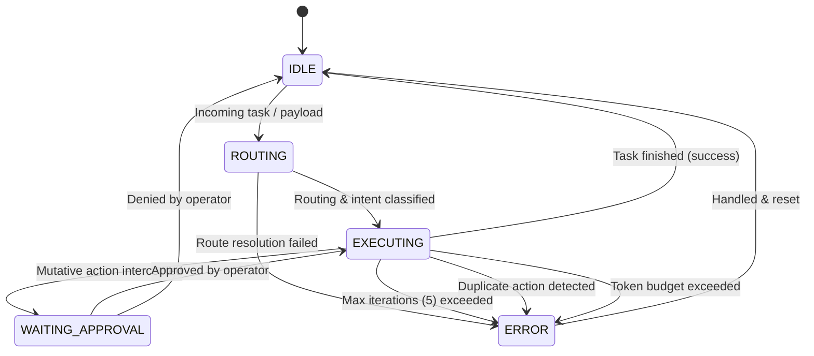

# Agent State Machine Specification & Safety Guardrails

> **Module:** `02-agent-runtime`  
> **Source Implementation:** `PROJECTS/zenswear-harness/packages/core/src/state-machine.ts`  
> **Status:** ✅ Enriched from Stage S05 implementation

---

## 1. Why a Deterministic Finite State Machine (FSM)?

LLM agents are non-deterministic. Without an external governing harness, autonomous agents run the risk of:
1. **Infinite ReAct loops:** Repeatedly invoking the same tool with identical parameters.
2. **Runaway cost:** Unmetered token consumption draining budgets.
3. **Destructive mutation:** Executing file deletions or database overrides without operator consent.

The harness wraps the LLM within a deterministic State Machine that intercepts every proposed action and enforces invariants.

---

## 2. State Diagram

---

## 3. Four Core Safety Guardrails

### 3.1 Hard Iteration Cap (Max 5)
Every task cycle starts at `iteration = 0`. If `currentIteration > maxIterations`, the harness forces an immediate transition to `ERROR` and stops calling the model.

### 3.2 Action Fingerprinting & Loop Detection
Each action is fingerprinted as `${toolName}::${JSON.stringify(parameters)}`. If two consecutive turns generate identical fingerprints, the agent is stuck in an unresolvable reasoning loop and is halted immediately.

### 3.3 Token Budget Tracking & Circuit Breaker
Every turn's prompt + completion token usage is accumulated. If `accumulatedTokens > maxTokensPerExecution`, a circuit breaker trips to `ERROR`.

### 3.4 Mutative Action Approval Gate
Actions marked with `isMutative = true` (e.g. ledger write, file delete, payment API call) automatically pause execution, switch state to `WAITING_APPROVAL`, and emit an `approval:requested` event. Execution cannot resume until `resolveApproval(true)` is called.
