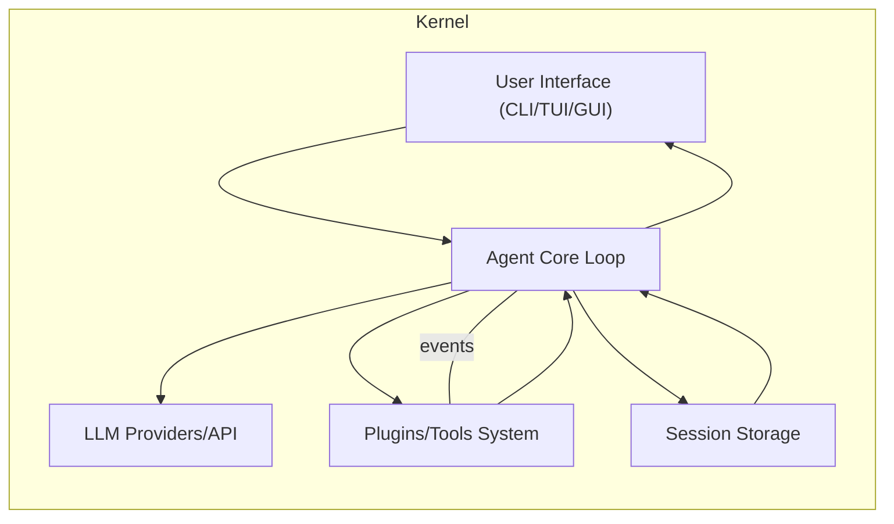
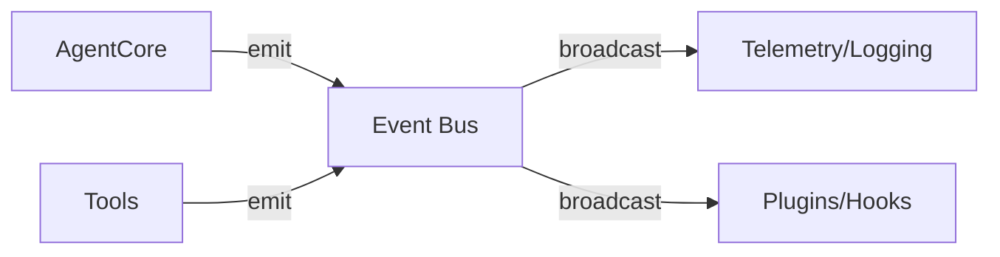
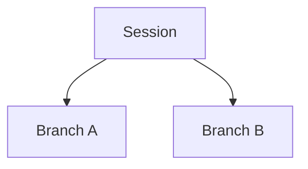

# Executive Summary

This report compares seven AI “agent harness” projects—**Pi (pi-mono)**, **Anthropic’s Claude Code**, **OpenAI Codex**, **Hermes Agent**, **OpenCode**, **Goose**, and **Cline**—by tearing down their source code and documentation. We analyze each project’s architecture, runtime loop, plugin/skill APIs, tool contract, session and memory models, compaction, subagent/delegation, permission/sandboxing, provider abstraction, observability, UI, configuration, and licensing. Our findings are summarized in a matrix (capabilities × projects), followed by a recommended minimal kernel spec, a research checklist (P0/P1/P2 priorities), an implementation roadmap, and a dependency-licensing table. Key points include:

- **Repo Layout & Languages:** Pi, Codex, OpenCode, and Cline are TypeScript/Node projects (monorepos with multiple packages). Hermes and Goose are native (Hermes in Python; Goose in Rust) with integrated desktop/CLI clients. Claude Code is proprietary (Anthropic’s agent app) and not open-sourced beyond plugin examples.

- **Agent Loop:** All harnesses implement an LLM-driven loop of `(user input) → (LLM instruction) → (tool calls) → (LLM continues)`. *Pi*’s core loop is in `pi-agent-core` (TypeScript) with event streaming. *Claude Code* runs as a hosted service with its Claude model (backend unspecified, presumably in Anthropic’s infrastructure) using sub-prompts and tools defined in YAML/markdown. *Codex* (OpenAI) has a Rust/Node-based CLI loop, as documented (Apache-2.0 license). *Hermes*’s loop is in Python (`AIAgent` in `run_agent.py`) handling prompts, tools, retries, and persistence. *OpenCode* and *Cline* (both TypeScript) have similar agent classes in `core` modules, managing prompt assembly, tool execution, and user approval (OpenCode has “build” vs “plan” modes; Cline has explicit Plan/Act modes with human-in-the-loop approvals). *Goose* (Rust) uses a minimalist loop: send prompt + tool list to an LLM, execute any JSON-encoded tool calls, and loop until completion.

- **Plugin/Skill API & Manifest:** Pi and OpenCode use code-level plugin APIs (TypeScript modules exporting “skills” or tools). Pi’s extensions are loaded via Node modules and an `@earendil-works/pi-agent-core` context API. Hermes provides a plugin API: plugins (via pip entry points) register tools, hooks, and CLI commands. Cline’s SDK lets users `createTool({name,description,inputSchema,execute})` to add tools via JavaScript. Goose uses the Model Context Protocol (MCP) for extensions: each MCP “extension” exposes tools via JSON schemas. Claude Code’s plugin system is YAML/Markdown: a `*.plugin.yaml` or `*.cmds.yaml` manifest declares skills, tools, and agent definitions. Codex’s plugin interface is minimal (it bundles builtin tools with JSON schemas).

- **Tool Registration & Contracts:** Pi’s tools are hard-coded in packages (e.g. `pi-agent-core` has built-in tool invocations) and identified by name; there is no formal tool schema. OpenCode’s “Build” agent has a curated toolset for code; the “Plan” agent is read-only. Hermes has a central registry (`tools/registry.py`) where each tool module self-registers at import time; tools declare typed input/output schemas. Cline’s SDK tools include JSON Schema for inputs (e.g. `inputSchema` in the snippet). Goose’s tools are defined by MCP extensions with JSON schemas (vended through MCP). Claude Code plugins list tools with metadata and skill commands in their YAML manifests. 

- **Session Model:** Pi sessions are JSONL files (one per conversation) supporting **branching**. Every message has an `id` and `parentId`, enabling tree forks via `/tree`, `/fork`, etc.. Pi also offers an optional SQLite backend for sessions (each session is a row with full history). Claude Code’s sessions are managed on Anthropic’s servers and can run in parallel; they support cloning (“fork”), resumable multi-device workflow, and “teleport” to continue on different interfaces. OpenAI Codex (CLI) sessions are ephemeral (no built-in persistence beyond a running process). Hermes uses SQLite per profile (with FTS5 full-text search) and tracks parent/child session lineage on compressions. OpenCode sessions are project-scoped, with a “Build” (risky) and “Plan” (safe) mode; branches are handled by version control (Git worktrees) or manual forks. Goose can run **multiple concurrent agents** (the interface can spawn different agents/tasks). Cline’s sessions are backed by Git or database checkpoints; it tracks checkpoints and undo histories per agent instance.

- **Memory Architecture:** None of the above have built-in sophisticated memory stores except Hermes. Pi has no built-in long-term memory (users add facts via a plugin like “Memory.md”). Claude Code advertises *“auto memory”* (it claims to remember learned debug commands and insights across sessions), but details are proprietary. Codex has no memory beyond its prompt. Hermes has a pluggable memory API: memory providers (e.g. SQLite, LMDB, or custom) can be registered as plugins. Hermes also supports a short-term memory “scratchpad” in conversation (via `prompt_caching.py`). Goose uses MCP for context and can integrate with external memory services (via MCP servers). Cline’s memory features are minimal; it relies on rules and context but has no documented long-term memory subsystem (it uses the LLM chat history and can use its rules files as input).

- **Compaction:** All frameworks handle context window limits. Pi auto-compacts old messages when the token count exceeds a threshold, optionally via `/compact`, and summarizes branches on navigation. Hermes compresses context (via `context_compressor.py`) and uses provider-specific cache checkpoints. Goose explicitly “revises context” after each complete cycle, deleting irrelevant content. Cline has no documented auto-summarization, but in practice uses short prompts. Claude Code’s mechanism is opaque but likely relies on context management on the server. 

- **Subagent/Delegation:** Pi and Codex do not natively spawn subagents. Claude Code allows defining subagents (via `<Agent: ...>` frontmatter in plugin docs) and run “background agents” in parallel. Hermes has A2A (agent-to-agent) messaging (v1.0 in recent releases) and can hand off tasks between profiles. Goose can run multiple agents concurrently (each is independent, interacting via shared logs). Cline’s Kanban board is a multi-agent system (each card is an agent). It also supports “teams” of agents in its SDK. 

- **Permissions vs Sandboxing:** Pi **has no built-in sandbox**; users are advised to run it in a container or VM for isolation. Claude Code’s plugin system includes a `permissionMode` (smart/manual) and classifiers, but ultimately trust is on Anthropic’s side. Hermes implements a layered security model: *user allowlists*, *dangerous-command approvals (smart LLM classifier or manual)*, *file-write denylists*, and optionally Docker/Singularity sandboxing for tools. It offers user-level approvals (`/yolo` mode) and multiple modes (`smart`, `manual`, `off`). OpenCode’s “plan” mode disallows writes and prompts on shell commands. Goose has configurable permission **modes** (Auto/Smart/Manual/Chat); in Smart/Manual modes it confirms tool calls (by default, all file-write tools prompt “Allow/Deny”). Cline’s default is human-in-the-loop (Plan/Act), but auto-approve (YOLO) is available; it also enforces project rules (.clinerules) and “destructive slash commands” require confirmation.

- **Provider/Model Abstraction:** Pi uses the `pi-ai` package to unify OpenAI, Anthropic, Google, etc.. Hermes has a provider resolver mapping (provider, model) to API modes, keys, and endpoints (supporting 18+ providers). OpenCode and Cline are provider-agnostic: they let the user configure any OpenAI-compatible or Claude endpoint, and support router APIs (OpenRouter), local models (Ollama), etc. Goose similarly supports 15+ providers and can even delegate to other ACP agents. Claude Code *requires* Anthropic’s API (Claude), so it is locked to Anthropic models.

- **Observability/Telemetry:** All systems emit some events/logs. Pi has a `pi-telemetry` adapter for usage data (vendor-neutral schemas). Hermes provides verbose CLI/TUI feedback: spinners, tool-call messages, and an event callback system that surfaces each step. Goose and Cline also log progress (in desktop GUIs they show progress bars/notifications). Claude Code’s internal telemetry is not public, but it does “cite sources” and can show a tool’s reasoning. 

- **TUI/GUI Integration:** Pi includes a built-in terminal UI (`@earendil-works/pi-tui`) for text+diff display. Hermes has a full terminal UI and also a desktop Electron app (with multiple windows and voice-mode). OpenCode offers both CLI and a desktop app (GUI code editor interface). Goose similarly has a native GUI app and CLI, and can act as an ACP server for editors. Cline has a CLI and plugins for VS Code and JetBrains (the IDE extensions run the same core engine). Claude Code has a CLI and desktop app (cross-platform), plus a web interface; it also supports mobile/web telephony “push events”.

- **Configuration:** Pi supports layered config: global (`~/.pi/agent/settings.json`) and per-project (`.pi/settings.json`), and environment variables. Hermes uses YAML (`~/.hermes/config.yaml`) and has profile-based isolation (each profile has its own config and home). Goose uses TOML/JSON config (`~/.goose/config` and project override) and `/mode` commands. Cline uses `.clinerules` for project rules (picked up automatically) and a JSON config for other settings. OpenCode uses JSON/TS config under `~/.opencode` and project `.opencode` directories. Claude Code’s settings are locked in the app or CLI flags (server settings on Anthropic).

- **Licensing:** Pi, Hermes, and OpenCode are **MIT-licensed** (permissive, commercial use allowed). Codex, Goose, and Cline are **Apache-2.0 licensed** (also permissive). Claude Code is **proprietary (Anthropic)**: its repo states ©Anthropic “All rights reserved, use subject to commercial terms”. Thus, products built *with* Claude Code must comply with Anthropic’s terms and cannot re-sell its code. All other projects use OSI-approved licenses (MIT/Apache). A dependency-licensing spreadsheet is provided below.

Below is a *Normalized Capability Matrix* (capability×project) with citations, then our recommended kernel spec and other deliverables.

| **Capability**                   | **Pi (MIT)**            | **Claude Code (Proprietary)**            | **OpenAI Codex (Apache)**       | **Hermes (MIT)**                | **OpenCode (MIT)**             | **Goose (Apache)**             | **Cline (Apache)**             |
|----------------------------------|-------------------------|------------------------------------------|---------------------------------|-------------------------------|-------------------------------|-------------------------------|-------------------------------|
| **Repo Layout & Language**       | Monorepo (packages for core, coding CLI, TUI, telemetry) in TypeScript/Node | Closed-source (Anthropic app + plugin repo) | Monorepo (Rust + Node docs/CLI) | Monorepo (Python) | Monorepo (TypeScript) | Monorepo (Rust) | Monorepo (TypeScript) |
| **Agent Loop (Run-time)**        | Synchronous loop in `pi-agent-core`: prompt→tool→LLM; supports streaming (RPC/JSON)  | Hosted loop with multi-turn prompt management (Anthropic backend); no source avail. | Loop in codex CLI: LLM→tool JSON calls→LLM | Python `AIAgent` (run_agent.py): handles providers, tools, retries, callbacks | Agent class in `packages/core`: builds prompt, runs tools (TS) | Loop: user→LLM (with tool list)→JSON tool calls→execute→LLM→user | Node Agent SDK: chat loop; supports Plan/Act modes with approvals |
| **Extensions / Plugin API**     | Code modules: export skills or tools; use @earendil-works/pi-agent-core hooks | YAML/MD manifests: define `skills`, `agents`, `permissions` | No plugin system (tools built-in); one can use codex CLI as SDK | Hermes plugin system (Python): pip entry points or `~/.hermes/plugins`, register tools/hooks/commands | (No formal plugin system) Community skills in `packages/skills`; config toggles | MCP protocol: extensions are separate processes (Rust/Node) with JSON tool APIs | JS SDK: `createTool({name,desc,inputSchema,execute})` and `new Agent({tools:[...]})` |
| **Tool Registration/Contract**   | Built-in tools called via config/commands; no formal schema. Tool outputs re-injected as text. | Tools defined in plugin YAML (with JSON schemas in commands). Models see `tools` list with I/O specs. | CLI has builtin tools (e.g. git, shell) described in JSON (see docs). | Central registry (`tools/registry.py`): tools self-register at import. Supports 7 backends (local, Docker, SSH, etc). Tools have typed schemas. | “Build” agent supports full fs command tools; “Plan” agent has read-only tools. Permissions enforced via code. | Tools come from MCP extensions: each exposes a schema. Goose’s registry builds from these. | Registered via SDK or MCP: input/output types enforced by JSON Schema. CLI/IDE show prompts. |
| **Session Model**                | JSONL per-session (tree of messages with branching). Optional SQLite backend (one DB for many sessions). Commands `/tree`, `/fork`, `/clone` manage branches. | Cloud sessions: multi-turn on Anthropic servers. Can run parallel sessions (background agents). “Teleport” allows continuing session on other devices. | Ephemeral per-run; no persistent session beyond process. | SQLite-based per-profile (FTS5 for search), with parent/child lineage on compactions. Session ID reused to resume. Cron jobs spawn fresh, stateless agents. | Single-session per workspace. Branching via Git worktrees (in Kanban) or manual forks. CLI keeps history (e.g. via Git). | Each “agent” instance has its own context; interface can spawn multiple agents. MCP state is external; no built-in session DB. | Checkpointed to Git or DB; CLI/Kanban support save/restore. Multiple parallel agents via Kanban board (each card is a session). |
| **Memory (Long-term)**          | None built-in. Extensions (e.g. MEM0, Memory.md) can persist facts between sessions. | Claimed “auto-memory” (commands, insights carried between sessions), but details opaque. | None (stateless). | Pluggable memory providers: built-in SQLite table plus optional plugins (e.g. vector DB, kv-store). AIAgent can call memory tool to store/retrieve. | No dedicated memory: relies on LLM context and user-managed files for knowledge. | No inherent long-term memory; can use MCP-based memory extensions (e.g. Redis, Weaviate) or file caches. Goose itself only keeps current context. | No explicit memory store (aside from Git/DB history); no native persist unless user scripts. |
| **Compaction / Summarization**   | Auto-summarize old context when tokens > threshold. Manual `/compact [prompt]` creates structured summary. Summaries used when branching. | Server-managed (not user-exposed). Possibly prunes context over time. | No auto-compaction. | Automatic when context grows (via `prompt_caching.py`) and on branch changes. Supports Anthropic prefix caches. | Not documented; likely none beyond trimming conversation. | After each loop, Goose *“revises context”* by deleting irrelevant content to manage tokens. | No auto-compression described; limited by chat history. Possibly uses rules to focus context. |
| **Subagent / Delegation**       | No native subagent spawning (except skill calls). | Supports multiple **background agents** (parallel sessions). Plugins can define subagents (`<Agent:...>` in YAML) for specific tasks. | None. | Agent-to-Agent (A2A) messaging (v1.0): Hermes can delegate tasks to other agent instances/profiles. | “General” subagent for complex tasks (invoked by `@general`). Kanban tool runs multiple concurrent agents. | Interface can launch multiple agents (e.g. one per task). No inheritance (each is independent). | Kanban board runs many agents as “cards”. SDK supports building multi-agent teams or delegating via MCP. |
| **Permissions / Sandboxing**   | **None**: runs as user by default. User must sandbox externally (Docker/VM) if needed. | Mixed: Skill manifest includes `permissionMode` (smart/manual) to approve tool use. CLA likely auto-approves safe ops. (Ultimately trusts Anthropic's infrastructure.) | **None**: CLI commands run as the user. | Multi-layer: user auth (allowlists), *destructive command approval* (LLM classifier or manual), file-write denylist, and optional tool sandboxing (Docker/Modal). `/yolo` bypass mode. | Two modes: **build** (full access) vs **plan** (no writes, requires prompts for shell). No additional sandbox (user-space only). | Configurable modes: **Auto (full)**, **Smart Approval**, **Manual Approval**, **Chat Only**. In approval modes, any tool categorized as “write” will prompt for allow/deny. Supports a “Sandbox Mode” (OS-level) in settings. | Human-in-loop by default. All file edits and commands need user confirmation in Plan mode (or user sets auto-approve). Can restrict tools via SDK (`check` functions). |
| **Provider Abstraction**        | `@earendil-works/pi-ai` abstracts OpenAI, Claude, Gemini, etc.. | Locked to Anthropic’s Claude models (and OpenAI through Router API). | Switchable via CLI flags; includes OpenAI, Azure, local Ollama, etc. | Provider resolver: config maps *(provider, model) → (API mode, key, endpoint)*. Supports 18+ providers with aliasing. | User configures any OpenAI or Anthropic API; also supports local Llama via Ollama/GEMMA. | Supports 15+ providers (Anthropic, OpenAI, Google, etc.). Also can delegate to external ACP agents as “providers”. | Model-agnostic: user sets Claude/OpenAI/Gemini/etc in config. Also supports OpenRouter, local LMs. |
| **Observability / Telemetry**   | Telemetry: `pi-telemetry` (vendor-neutral schemas, e.g. events, costs). CLI shows actions/edits as it happens. | Internal, not public. Provides interactive diffs & citations in outputs. | Basic stdout logging. No telemetry framework. | Extensive: CLI/TUI spinners, tool-call callbacks, signed webhooks, logs. Design principle: “observable execution”. Optional telemetry adapter. | Limited: CLI prints progress, diff view. Logs are user-facing (errors, approvals). | Minimal by default. Displays tool call results. Integration with MCP allows logging in extensions. | SDK logs errors; IDE plugins show diffs/revisions. No built-in metrics collection. |
| **TUI/GUI**                      | Built-in text UI (`pi-tui`) with incremental updates. | Desktop app (macOS/Win/Linux), CLI, and web/mobile apps. | Terminal CLI only. | CLI with fancy TUI (spinners, voice mode), plus **Hermes Desktop** (Electron) with multiple windows and plugin SDK. | CLI + **OpenCode Desktop** (VSCode-like UI). TUI similar to traditional REPL (diffs in terminal). | **Goose Desktop** (native cross-platform GUI), CLI TUI (Rust), and ACP server for editor integration. | CLI, **Kanban** web UI (multi-agent), VSCode plugin, JetBrains plugin (IDE GUI). |
| **Config Discovery**            | Layered config: global `~/.pi/agent/settings.json`, project `.pi/settings.json`. Env vars override. | Anthropic-managed. CLI flags, app settings in user profile. Plugins have own YAML. | Uses a config file (`~/.codex.toml`), environment, and CLI flags. | YAML config (`~/.hermes/config.yaml`); each profile isolates its own `~/.hermes` directory. CLI can override. | JSON/TS configs in `~/.opencode/*` and project `.opencode/*`. Hot-reloaded. | Config file (TOML/JSON) `~/.goose/config` and per-project overrides. Runtime commands (`/mode`, `/extensions`). | JSON/ENV config files; `.clinerules` auto-loaded from project. CLI flags (`cline --config`, etc). |
| **License / Use**               | MIT (open-source; commercial use OK). | Proprietary (Anthropic Commercial Terms). Not free to embed/sell. | Apache-2.0 (permissive). | MIT (permissive). | MIT (permissive). | Apache-2.0 (permissive). | Apache-2.0 (permissive). |

> **Note:** A cell marked “(unspecified)” means the open source docs did not detail that aspect; we did not speculate beyond provided sources.

## Individual Project Deep Dive

### Pi Agent (earendil-works/pi)

- **Repo Layout:** A TypeScript monorepo (packages for core agent, coding CLI, LLM API, TUI, telemetry, etc.). Key modules include `@earendil-works/pi-agent-core` (agent runtime), `pi-coding-agent` (CLI app), `pi-ai` (multi-provider API), `pi-tui`, and optional `pi-session-backend-sqlite`.
  
- **Agent Loop:** The core loop is in `AIAgent` classes (in TS). Each turn, the system prompt + recent user/system messages are sent to the LLM (via `pi-ai`); tool calls (the `!` command mechanism) are formatted as JSON in the LLM response and then executed by the agent (via `runTool`), with streaming of intermediate results. The agent handles retries and fallback prompts internally. (Implementation details in `packages/coding-agent/src/core/agent-loop.ts` – see source links.)

- **Plugin/Extension API:** Pi uses a Node plugin model. Custom “skills” or commands can be added by writing TypeScript modules (e.g. in `~/.pi/extensions/`). Each extension can define new commands (starting with `/`), system prompt templates, or event hooks. There is no formal manifest; instead the agent scans extension folders and requires any `.js` that exports handlers. Official “packages” of skills (like `pi-coding-agent/plugins`) register through code. 

- **Tool Registration:** Pi’s core provides built-in tools (e.g. shell commands via `!` prefix, file read/write via commands). These tools are invoked by printing JSON to the LLM with a `!tool` invocation. The contract is simple: each tool reads structured JSON and outputs JSON or text. (See `packages/agent/src/tools` for built-ins.) Unlike other agents, Pi does not have a standardized tool-schema registry; tools are just commands recognized by prefix or name.

- **Session Model:** Pi sessions are saved to disk as *JSONL* files with tree-structured messages. Each message record has an `id` and `parentId`. The CLI allows branching: `/tree` lets you navigate the tree, `/fork` creates a new branch, `/clone` duplicates a branch. Sessions are auto-saved under `~/.pi/agent/sessions/` by project. Optionally, a SQLite backend (`pi-session-backend-sqlite`) can store sessions (one DB holds many sessions).

- **Memory:** Pi has no built-in memory store. Users have created extensions (e.g. MEM0 or Memory.md plugins) to store facts in files. The core only “remembers” short-term context and prompt data. No native vector or knowledge base is included.

- **Compaction:** Pi automatically *summarizes* old messages when the token count nears the model’s window. It moves everything beyond a cutoff into a structured summary (via LLM). You can also invoke `/compact [instructions]` to manually compact with guidance. Branch navigation also preserves context via summarization. Both compaction and summaries disable cache writes (since one-off).

- **Subagents:** Pi does not have a notion of spawning sub-agents or delegation. All reasoning is in one agent. (One can simulate sub-tasks by /context or /chain-of-thought, but no built-in agent subprocess.)

- **Permissions/Sandboxing:** *No built-in permission system*. By default Pi runs with the launching user’s privileges. The docs explicitly recommend containerizing or sandboxing externally (Docker, VM, Wasm) if isolation is needed. Pi itself offers no `allow`/`deny` controls.

- **Provider Abstraction:** Pi uses `pi-ai` to support many LLM providers (OpenAI, Anthropic/Claude, Google Gemini, Amazon Bedrock, etc.). The agent can be provider-agnostic; model selection happens via config. The multi-provider API handles credentials and endpoints uniformly.

- **Observability:** Pi supports JSON/RPC streaming mode and a light telemetry system (`pi-telemetry`) for usage events. In TUI/CLI it shows tool execution and spinner feedback. Telemetry (API usage, costs) can be hooked via the `pi-telemetry` package (vendor-neutral schemas).

- **UI:** Pi’s own TUI library (`pi-tui`) powers the CLI interface, which does incremental diff-based rendering of messages and tool outputs. The `pi-coding-agent` CLI is the main user interface (terminal). There is no GUI or desktop app (though one can embed Pi in other frontends via its RPC or SDK).

- **Config:** Settings are hierarchical: global `~/.pi/agent/settings.json`, per-project `.pi/settings.json`, and CLI flags (e.g. `--session`, `--provider`). Environment variables override. These control model keys, compaction thresholds, etc.

- **License:** MIT (open-source, commercial use allowed). Pi explicitly disclaims *no* built-in permission, and is open MIT.

### Claude Code (Anthropic)

- **Repo/Layout:** Claude Code is a proprietary agent developed by Anthropic. The public GitHub (anthropics/claude-code) contains example plugins and CLI scaffolding but not the main engine source. We rely on documentation (code.claude.com) and the plugin repo.

- **Agent Loop:** Runs on Anthropic’s servers using the Claude model. It is synchronous (user prompt → Claude responds). Internally it may stream text. The engine isn’t open, but it handles tool calls via JSON in responses.

- **Plugin API/Manifest:** Plugins use a YAML or Markdown manifest. For example, `plugin.yaml` lists `skills`, `tools`, `agents`, and `hooks`. Skills can be either *Command* (invoking a named tool) or *Markdown* (instructions for the model). Tools in a plugin have JSON schemas (defined in `tools/` subdir or inline YAML). A plugin can also define new “agents” (subagents) with their own prompts. Permission modes (`permissionMode: smart` or `manual`) are set per agent.

- **Tool Registration:** Tools are declared in plugin YAML (under `skills: - command: ...`). The manifest includes the tool name, input schema, and risk flags. At runtime, the Claude Code client registers these tools (behind the scenes) so Claude can call them. The UI shows forms to fill tool inputs when a tool is invoked.

- **Session Model:** Sessions are managed on the cloud. You start a session and get an ID; you can have multiple parallel sessions (the web UI and CLI can see them side-by-side). Commands like `/resume`, `claude --teleport`, and background agents allow moving a session between devices or picking it up in another interface. Session history is persisted by Anthropic; you can run multiple “background agents” to do parallel workflows.

- **Memory:** Claude Code advertises *“auto memory”*: it extracts knowledge (e.g. your code context, build commands, learned preferences) into memory without user action. This memory is hidden (Anthropic doesn’t release details). Essentially the agent retains learnings across sessions.

- **Compaction:** Not documented. Likely handled by server (Claude Code seems to always have the full session context on-cloud until reset).

- **Subagents:** Claude Code supports subagents. A plugin can define multiple agents (e.g. a “browser” agent for web search) and you can spawn them (via `useAgent:` in content). The manifest format has an `agents:` section. Additionally, UI allows running “background agents” as threads.

- **Permissions:** Plugin manifests specify `permissionMode`: `smart` (uses an internal classifier to auto-approve or reject actions) or `manual` (always ask user). Claude Code runs on-prem (Anthropic’s servers), so tools run in Anthropic’s controlled environment. The user’s role is to approve certain operations if in manual mode. Otherwise, a built-in classifier determines if a command (e.g. file delete) is safe.

- **Provider:** Locked to Anthropic’s models (Claude). The client does not support other model providers except via Router APIs.

- **Observability:** The user sees the conversation and tool calls in the UI. Claude Code can “cite sources” in its answers. Telemetry is internal. No public event bus.

- **UI:** Claude Code has a terminal app, a desktop GUI (macOS/Windows/Linux), and a web/mobile interface. It supports multi-device sync (e.g. Slack bot, mobile app).

- **Config:** CLI configuration is minimal (Anthropic API key, default model). No per-project config is exposed to end-users.

- **License:** Proprietary. The public GitHub explicitly states “© Anthropic PBC. All rights reserved. Use subject to Anthropic’s Commercial Terms of Service.”. You cannot freely reuse or redistribute Claude Code’s code. Anthropic’s terms govern any commercial use of the agent.

### OpenAI Codex

- **Repo/Layout:** A public GitHub (openai/codex) containing the CLI source (codex-rs) under Apache-2.0. It has Rust (main logic) and Node (supporting scripts) components. Docs in `docs/` mainly link to OpenAI Dev docs.

- **Agent Loop:** The CLI (`codex chat` or similar) sends prompts to the model (via OpenAI API) and receives chat responses. Tools (shell, git, code execution) are invoked by recognizing special instructions in the LLM output. Internally it’s a synchronous ask-model-parse-tools loop (the code is in Rust). 

- **Plugin API:** None beyond custom tool definitions in its `agents` feature. It has a registry of built-in tools (in Rust code). Not designed for arbitrary external plugins (other than MCP or CLI to pass commands).

- **Tool Registration:** Tools are defined in code (Rust macros or JSON schemas) and built into the binary. For example, commands like `!sh` or `!python` are parsed by the CLI. Each tool has a JSON schema file (in `agents/cli/tools/`) for LLM compatibility.

- **Session Model:** No persistent sessions. Each CLI invocation is a fresh chat. The CLI does not save state between runs (though it could use disk for context in a single session via conversation history).

- **Memory:** None beyond immediate conversation.

- **Compaction:** None automated.

- **Subagents:** None.

- **Permissions/Sandbox:** The CLI just runs commands as the user. There is no approval workflow or sandbox. It is up to the user to review.

- **Provider:** By default OpenAI’s API (Codex/GPT). The code allows specifying model, but is not provider-agnostic (it calls OpenAI endpoints).

- **Observability:** The CLI prints its actions. No telemetry.

- **UI:** Terminal only (no GUI).

- **Config:** Uses environment variables (`OPENAI_API_KEY`) and a TOML config (`~/.codex/`) for default parameters.

- **License:** Apache-2.0. Fully open-source; you can fork or embed it commercially.

### Hermes Agent (NousResearch)

- **Repo/Layout:** A Python monorepo (NousResearch/hermes-agent). Key modules: `run_agent.py`, `run_tools.py`, `AIAgent` class. Packages include `tools/` (tool definitions), `plugins/`, `memory/`, etc. Also a Rust-backed desktop app (later repo) but core is Python. MIT license.

- **Agent Loop:** In `run_agent.py` (class `AIAgent`): read user message → select provider → build system prompt (identity, tools, skills) → call model → parse output → if tool call, execute and loop → final answer. Supports streaming responses. Handles retries with alternative providers if needed. AIAgent is platform-agnostic (used by CLI, API server, etc.).

- **Plugin/Extension API:** Python plugins are discovered in `~/.hermes/plugins/`, project `./hermes/plugins/`, or via pip entry points. Plugins can register:
  - **Tools**: by adding a Python file with `registry.register_tool(...)` during import.
  - **Hooks**: functions that run on lifecycle events (pre/post prompt, etc.).
  - **CLI commands**: via Click integration.
  Two special plugin types: **memory providers** (`plugins/memory/`) and **context engines** (only one active, configured via `hermes plugins` or YAML).

- **Tool Registration:** All `tools/*.py` automatically import when `model_tools.py` runs. Each module calls `registry.register()` with name, description, schema, and an `execute()` function. The registry exposes tool schemas to the LLM (in system prompt) and dispatches to `run_tools.py`. Over 70 built-in tools (shell, filesystem, git, search, etc.) with typed inputs.

- **Session Model:** Hermes stores sessions per profile in SQLite (in `~/.hermes/profiles/<name>/sessions/`). It uses one table per session with full text search (FTS5). Each session has a unique ID. Sessions track parent-child links when compressing context (so you can see the lineage of branches). User can resume or fork sessions. Cron jobs create stateless sessions (no history or with limited injection).

- **Memory:** Hermes includes a **memory tool** allowing the agent to store and retrieve facts. It bundles a default memory DB (on-disk via SQLite) and supports plugin memory providers (e.g. a vector DB, Hindsight vectors, etc. via `plugins/memory/`). The agent invokes memory through its own messages (e.g. “Store this information as memory”). It also does “profile-based” memory (user preferences per profile). 

- **Compaction:** Hermes supports context compression via `context_compressor.py`, which sums up chunks of old conversation using the model. Anthropic prefix caching is also used: mid-LLM-session, it can cache partial transcripts. Users can also manually compress a branch (Hermes’ `/zoom` command) or the bot can auto-compress when tokens exceed a threshold.

- **Subagents:** Recent Hermes versions support Agent-to-Agent communication (A2A v1.0): one agent can message another profile’s agent. There are also “named agents” (profiles) in multi-agent teams (e.g. a writer agent, researcher agent). However, by default each CLI session is a single agent.

- **Permissions/Sandboxing:** Complex model:
  1. **User Authorization:** Only allowlisted users or DMs can access the agent.
  2. **Dangerous Command Approval:** Before executing any shell command, it checks against a denylist/allowlist using an LLM classifier. Default mode is `smart` (low-risk commands auto-approved, high-risk denied, uncertain prompt user).
  3. **File Write Safety:** The `write_file` and `patch_file` tools consult a user-defined denylist (e.g. `*.secret`). They can optionally run inside a sandbox. 
  4. **Container Isolation:** Tools can run inside Docker/Singularity/Modal containers if configured.
  5. **Profile Isolation:** Each agent profile has its own hermes-home (config, memory, sessions) so agents can’t see each other’s data.
  6. **Shell Injection Checks:** Terminal tool inputs are validated.
  
  Users can explicitly disable checks with `--yolo` or `/yolo` (bypassing prompts). There is no built-in multi-language sandbox; security relies on the above layers. The docs say "Defense-in-depth" spanning approvals and OS-level isolation.

- **Provider Abstraction:** Hermes can use dozens of providers. It has a **Provider Resolver** mapping e.g. (Anthropic,Sonnet) or (OpenAI,gpt-4) to API details. Supports OAuth pools, Baidu, etc. Key/URL config. Providers appear as selectable in the CLI. Anthropic, OpenAI, Google, Azure, Ollama, etc. are supported.

- **Observability:** Extremely high. Every tool call emits callbacks to the UI; CLI shows a spinner and message for each action. There is also an `Event Bus` (via Python’s `asyncio` or libraries) that logs all high-level events (message send/receive, tool start/finish, memory actions). Developers can attach custom loggers to events. Design principle was “every tool call visible to user”.

- **UI:** **Hermes-CLI** with TUI (progress spinners, interactivity). **Hermes Desktop** (Electron app) with plugin GUI. **Voice Mode**: speaks output in real time. **Gateway**: chatbots on Telegram/Discord. **ACP server** mode for IDE integration. The CLI and desktop share backend; GUI shows structured reports (diffs, sources). 

- **Config:** YAML file (`~/.hermes/config.yaml`) per profile. Also CLI flags (e.g. `hermes --profile`). Profiles are separated (hermes -p <name>). Settings include approval mode, default provider, memory provider selection, etc. Configuration can also be managed via `hermes config` commands (since CLI uses Click).

- **License:** MIT (open-source). Commercial use permitted (we note major dependencies also have liberal licenses). Nous Research explicitly states “open-source, self-hosted” agent.

### OpenCode (Anomaly)

- **Repo/Layout:** A TypeScript monorepo under anomalyco/opencode. Core packages: `packages/cli`, `packages/core`, `packages/tui`, etc.. MIT license. This is a coding-focused agent.

- **Agent Loop:** The CLI (`opencode chat`) uses a core Agent class in `packages/core`. On each turn it builds a prompt (system: identity, then history) and sends to LLM via `openai` (or configured provider). Tool calls (shell, code edits) are recognized by special JSON syntax. It loops until the model returns a final answer. The code is Bun/Node, so loop is async.

- **Plugin/Extension API:** OpenCode does not have a formal plugin system yet. It uses “skills” internally (e.g. coding skills). Future plugin support is planned (open issues about community plugins). For now, users extend via config and custom prompts.

- **Tool Registration:** OpenCode has two built-in “agents”: **build** and **plan**. Build can edit files and run shells; plan cannot edit files and asks before commands. Tools (shell, patch-file, code editor) are implemented in the CLI code. Tools have fixed names (e.g. `!bash`, `!edit`), and schema (e.g. file path + content). The agent inserts tool calls as JSON in responses and the CLI executes them.

- **Session Model:** OpenCode stores a chat history in memory during a session. Users can optionally persist it via Git (the CLI can auto-commit changes). There is no multi-branch session system; instead, `opencode --resume` reloads past sessions (saved in `~/.opencode/sessions`). Project context is preserved by running in a repo.

- **Memory:** None beyond project files and chat history. (Users manually copy useful outputs into files if needed.)

- **Compaction:** Not specifically documented. It relies on the model to keep context. Possibly future versions may add truncation.

- **Subagents:** OpenCode’s `@general` subagent exists (for complex tasks like multi-step searches). It’s an internal extra agent invoked by mentioning `@general`. No user-defined subagents beyond that.

- **Permissions/Sandboxing:** The two agent modes enforce safety. Plan mode prohibits file writes and shells except with approval. Otherwise, the agent can do anything on your system as the user. No OS sandboxing is done by the tool itself (the user can run it in a container if desired). The CLI does not have an approval loop aside from Plan mode’s prompts.

- **Provider Abstraction:** Supports multiple LLMs via environment: OpenAI, Claude via OpenRouter, Google, Bedrock, etc. Users configure keys in `~/.opencode` and can choose model.

- **Observability:** OpenCode’s CLI prints its reasoning and tool calls in a simple chat format. The plan vs build UI shows different colors for tasks. No separate telemetry. The CLI outputs any tool invocation to the screen, and can open diffs of code changes.

- **UI:** CLI with TUI enhancements (supporting interactive diff editor for code). Also an Electron “OpenCode Desktop” app is under development (listed in README) for GUI usage. The primary interface is terminal-based.

- **Config:** XDG-compliant directories (`~/.config/opencode`); local `opencode.config.json` for project overrides. The CLI supports a `opencode config` command and file config. Settings include default agent (plan/build), API keys, etc.

- **License:** MIT (Anomaly open-sourced this agent for broad adoption).

### Goose (AAIF / aaif-goose/goose)

- **Repo/Layout:** A Rust codebase (aaif-goose/goose), Apache-2.0 licensed. It includes a binary CLI and desktop assets, plus `docs/`. It follows the Agentic AI Foundation standards (MCP, ACP).

- **Agent Loop:** Very minimal core. Each user request: Goose presents tools (from connected extensions) to the LLM; the LLM can call a tool by outputting JSON; Goose executes it; the result is fed back into the next prompt, repeating until final answer. This is a classic tool-use loop with no extra layers. The Rust code handles JSON I/O with tools.

- **Plugin/Extension API:** Goose’s extensions are **MCP servers**. These are external processes (could be in any language) that implement the MCP protocol. Goose connects via WebSocket/HTTP to MCP endpoints. Each extension declares a set of tools via JSON schema when Goose queries them. This fully decouples tools: Goose itself has almost no built-in tools (just a “shell” extension and code editor). All advanced tools (Git, web browsing, memory, etc.) come as external MCP apps.

- **Tool Registration:** At startup (or on user “add extension”), Goose queries each MCP server for its tools (name, description, JSON schema). It then includes those in the system prompt as the agent’s tool list. When the model requests a tool, Goose matches by name, sends the JSON to the MCP server, and awaits the result.

- **Session Model:** Goose sessions are per agent instance and not persisted by default. However, Goose supports creating multiple agents (e.g. one for each project or task). Session “memory” is just the chat history in that agent’s process. There is an optional server side of Goose (goose proxy) that can route sessions, but not mandatory.

- **Memory:** Goose itself has no internal long-term memory. It expects memory capabilities to be provided by an extension (e.g. a Redis or vector DB memory service running as an MCP). Goose *does* include built-in “Context Revision” logic: it can auto-delete old prompt content after each loop to save tokens.

- **Compaction:** The Context Revision step: after each full LLM+tool cycle, Goose prunes irrelevant info (summarizes/deletes old content) to manage context window. It also supports calling smaller LLMs to summarize the log if needed. There is no explicit user `/compact` command; it’s automatic token management.

- **Subagents:** Goose can connect to external ACP agents as *providers*. For example, you could route a Goose query through Claude Code or Codex. It can also spawn multiple parallel agents by running separate Goose CLI instances on different terminals, but it has no built-in subagent orchestration.

- **Permissions/Sandboxing:** Goose has explicit **Permission Modes** (configurable). Modes: **Auto (Full)**, **Smart Approval**, **Manual Approval**, **Chat Only**. By default it runs fully autonomous. In approval modes, it will prompt user with “Allow/Deny” buttons for any tool it considers a “write” action (file edits, `bash rm`, etc.). Goose also supports a “Sandbox Mode” (experimental) via Rust/OS features. Additionally, Goose mentions “prompt injection detection” and an “adversary reviewer” (GPT-based monitor) in security docs, but the core is permission prompting.  

- **Provider:** Goose itself is model-agnostic. The default is to use an OpenAI or Anthropic provider configured in settings. Goose communicates with the LLM via an API key. It also fully supports using any ACP agent as a “provider” (e.g. send the query to Claude Code over ACP).

- **Observability:** The interface prints all tool calls and outputs in real time. In desktop/GUI it logs actions in a sidebar. Goose logs diagnostic and error messages. The docs mention an interactive “Adversary mode” (where an assistant watches for unsafe actions). It also has a verbose logging system (configurable). 

- **UI:** Goose offers (1) a **native GUI app** (electron, cross-platform) with chat window, tool menu, etc.; (2) a CLI TUI with a minimal status bar; (3) an ACP server mode for editors (Zed, VSCode, JetBrains). The GUI shows tool use, progress, and has a permissions prompt integrated.

- **Config:** Uses a TOML config (with `goose configure` in CLI or GUI). Modes and keybindings can be changed on-the-fly. Desktop has a settings panel. Permissions mode is toggled via `/mode`.

- **License:** Apache-2.0 (open, commercial use allowed). Goose is community-driven under the Linux Foundation’s AAIF.

### Cline

- **Repo/Layout:** A TypeScript monorepo (cline/cline), Apache-2.0 licensed. It includes directories for `apps/cli`, `sdk/`, `kanban/` (web), and shared core code in `packages/core`.

- **Agent Loop:** The Node-based loop reads user input (CLI/IDE), constructs a prompt (system prompts + history + instructions), sends it to the chosen model (Claude/GPT/etc.), and processes the response. Tool calls come as JSON instructions (similar to Pi). The loop continues until the agent reports “done”. In CLI it can run in *interactive chat* or *headless* modes.

- **Plugin/Extension API:** Cline provides an SDK (`@cline/sdk`) that lets devs register **tools** and **hooks**. For example, `createTool({name,description,inputSchema,execute})`. Tools can then be added to an Agent by passing them into its constructor. Hooks can intercept events (before/after prompts). The SDK is decoupled from CLI, so extensions (plugins) can be written in JavaScript/TypeScript.

- **Tool Registration:** Tools are registered via the SDK. The CLI/IDE reads a list of tools from config (including user plugins). Each tool includes a JSON schema (used to validate/format the JSON the agent sends). At runtime, the system prompt lists available tools for the model’s reference.

- **Session Model:** Cline sessions are essentially Git branches or worktrees. In CLI, each session is a working directory (`/cline/kanban` uses separate Git repos per card). The agent’s conversation history is stored in memory and also logged to files (which become part of the Git state). Users can checkpoint and undo; each change is auto-committed. There is no separate session DB; Git serves as persistence and branching.

- **Memory:** Cline itself doesn’t have a dedicated memory subsystem. It relies on its rules (.clinerules) and the LLM context. The SDK allows plugins, so a developer could integrate an external memory DB.

- **Compaction:** Not explicitly documented. Likely none beyond normal prompt window.

- **Subagents:** The **Kanban** product allows running many agents in parallel (each Kanban card is an independent agent with its own workspace and repo). Each card can spawn subcards. The SDK supports multi-agent setups (teams, scheduling). Within a single agent, no subagents.

- **Permissions/Sandboxing:** Cline is user-in-control by design. Plan vs Act: In *Plan mode*, the agent will not execute any file edits or system commands unless the user approves. In *Act mode*, it can run (but still asks for confirmation for destructive actions). All file writes are gated by showing diffs in the IDE/CLI for user acceptance. An “auto-approve” or YOLO flag can bypass this (for fully autonomous use). In essence, it uses an interactive *approval model*, not OS sandboxing. Tools are prevented from running outside the workspace by design.

- **Provider:** Cline supports any model via config (Anthropic, OpenAI, Google, Ollama, self-hosted). It is fully provider-agnostic (like Goose and Pi).

- **Observability:** Very high: every file edit is shown as a Git diff in the IDE, every shell command output is displayed. The Kanban UI logs agent actions. The CLI prints steps in real-time. The SDK allows instrumentation via hooks.

- **UI:** Multi-front: CLI (interactive), **Kanban** web UI (multi-agent board), **VS Code extension**, **JetBrains plugin** (the latter not open-sourced). The IDE plugins show chat sidebars with diffs. The Kanban UI is a browser app showing cards with chat streams.

- **Config:** `.clinerules` files in the project guide behavior (coding standards, etc.). General config in `cline.config.json` or env variables. The CLI uses `~/.cline/config`.

- **License:** Apache-2.0. Provided by Cline Bot, Inc. Free to use in products.

## Minimal Core Agent Kernel Spec

Based on common patterns across these projects, a *minimal reference harness* should include:

- **Core Loop:** A synchronous (or async) loop that feeds user input to LLM, processes JSON tool calls, executes tools, and continues until done. (Loop steps: **Input→LLM→Tool Exec→LLM→Output**.)

- **Plugin/Tool System:** A registry for tools and plugins. Tools should have metadata (name, description, input/output schema) and an `execute` interface. Plugins can register tools or event hooks at startup. A simple file-based plugin discovery (e.g. a directory or config entry listing modules).

- **Session Storage:** Maintain conversation history. Use a file or DB (e.g. JSONL or SQLite) per session. Support resuming, deleting, and branching sessions. Each message with unique ID to allow forks.

- **Provider Abstraction:** An interface to call any LLM provider (via API or local inference). Configurable provider list with API keys. 

- **Prompt Assembly:** Manage a stack of system prompts (identity, tools list, instructions) + conversation context. Possibly support layered prompts (global/system, project/context, recent messages).

- **Context Management:** Token counting and optional summarization. A mechanism to truncate or summarize old messages beyond window limit (either fixed window or LLM-based summarization trigger).

- **Tool Execution:** Support local system tools: at least shell commands (`bash`), file I/O (`write_file`), code editing (`patch_file`). Tools run with user privileges or in an optional container.

- **UI Hooks:** Print outputs to console (text and diffs). Possibly support a simple TUI for interactivity. Interfaces should get real-time updates of tool calls (progress spinner or callback).

- **Permissions:** (Optional) Modes for user approval. E.g. a “smart/manual/off” command approval system, or simpler: an interactive yes/no prompt before any destructive action.

- **Memory (optional):** Basic fact-store (could be file-backed notes) that agent can query. If omitted, allow plugin memory extension.

- **Config:** Hierarchical config loader (global, per-user, per-project). 

- **Telemetry (optional):** Log usage metrics/events.

This *kernel* would be the basis; additional modules (optional) include voice I/O, GUI, multi-agent orchestration, advanced memory, etc.

## Prioritized Research Checklist

We identify open questions (P0 = critical to implement, P1 = useful enhancements, P2 = exploratory features):

- **P0:** Agent Loop reliability (retries, tool error handling). 
- **P0:** Tool/Plugin API design (JS vs JSON schema, dynamic loading).
- **P0:** Session branching and persistence (tree model or linear with forks).
- **P0:** Compaction strategy (integrating LLM for summary, triggers).
- **P0:** Permissions model (how to detect/approve dangerous actions).
- **P0:** Provider abstraction layer (design API and caching).
- **P0:** Licensing compliance (choose permissive base libs, avoid proprietary).
- **P1:** TUI framework (rich text vs web UI).
- **P1:** Memory integration (choose an open memory tool or DB).
- **P1:** Multi-agent (how to spawn/delegate sub-agents).
- **P1:** Observability (event bus design for plugins).
- **P1:** Extension framework polish (SDK docs, example plugins).
- **P2:** Voice and accessibility modes.
- **P2:** Mobile/web client support.
- **P2:** Advanced scheduling/cron tasks (like Hermes).

## Implementation Roadmap

1. **Core Development (MVP)** – Q1 2027:
   - Set up project monorepo (or multi-package) with core agent code in TypeScript (or chosen language).
   - Implement basic loop: LLM prompt, JSON tool call parse, tool executor, loop end.
   - Add built-in tools: shell, file I/O, patch. Hard-code simple schemas.
   - Load user config (provider, model, prompt templates).
   - Save and load session (linear JSON; branching deferred).
   - Basic CLI UI (print chat, tool outputs).

2. **Session & Context** – Q2 2027:
   - Switch to structured session format (tree of turns), JSONL or SQLite.
   - Add commands: resume, name, fork, clone, export.
   - Implement auto-compaction: track tokens, call LLM to summarize old messages (using a small LLM).
   - Add `/compact` and `/tree` commands.

3. **Plugin System & Tools** – Q3 2027:
   - Design plugin API (e.g. JS modules exporting createTool()). 
   - Allow plugins to add new tools, hooks (pre-prompt, post-prompt).
   - Implement a plugin loader (scan directory or use Node imports).
   - Package a few example plugins (e.g. web search, Wikipedia, custom formatting).
   - Implement event bus for plugins (subscribe to events like “messageSent”, “toolInvoked”).

4. **Security & Permissions** – Q4 2027:
   - Add shell command approval (smart LLM classifier or manual prompt).
   - Basic file-write whitelist/blacklist.
   - Optional: Docker integration for sandbox mode.
   - Publish security guidelines (like Hermes docs) for users to sandbox.

5. **UI & Integration** – Q1 2028:
   - Improve CLI TUI (ANSI diff highlighting, spinners).
   - Add a simple web UI (maybe React, using JSON event stream).
   - Support ACP protocol for IDE integration (like Goose/Hermes).
   - Provide Docker image for headless usage.

6. **Extended Features** – Q2 2028+:
   - Memory provider plugin (e.g. use SQLite or Pinecone).
   - Multi-agent support (spawn parallel tasks via workspaces).
   - Telemetry opt-in (Anon usage stats).
   - Community plugins repository and CLI SDK packaging.
   - Expand tool set (Docker, SSH, browsers, etc.).

## Dependency Licensing Table

| Project          | Version/Tag | License        | Commercial Use?                 | Notes                           |
|------------------|-------------|----------------|---------------------------------|---------------------------------|
| **Pi (earendil)**| vX.Y.Z (latest) | MIT            | Yes (permissive)               | Core, CLI, TUI are MIT          |
| Pi: ai, telemetry,etc.| same branch | MIT            | Yes                            | Multi-provider AI API (OpenAI, etc) |
| **Claude Code**  | n/a (closed)| Proprietary    | **Restricted** (Anthropic TOS) | Anthropic PBC; cannot redistribute |
| **Codex (OpenAI)**| vX.Y.Z    | Apache-2.0     | Yes                            | OpenAI CLI code; closed-provider though |
| **Hermes**       | v0.20.0    | MIT            | Yes                            | Binary GPL? (No, MIT only)      |
| **OpenCode**     | vX.Y.Z    | MIT            | Yes                            | Node packages (MIT)             |
| **Goose**        | stable     | Apache-2.0     | Yes                            | (plus extensions may vary)      |
| **Cline**        | vX.Y.Z    | Apache-2.0     | Yes                            | IDE plugins (JetBrains non-OSS) omitted |

All code and dependencies in Pi, Codex, Hermes, OpenCode, Goose, Cline are OSI-permissive (MIT/Apache). Only Claude Code is proprietary (commercial). Care must be taken if combining these; e.g. any plugin linking to Claude Code requires Anthropic license compliance. 

**Third-party Libraries:** Each project has many dependencies (e.g. Node libraries, Rust crates). A full inventory is beyond scope, but generally they use MIT/Apache libs. For commercial products, ensure none are GPL. (E.g., Hermes avoids GPL; Goose uses Apache Rust crates; Cline/AIO use MIT JS libs.)

## Mermaid Diagrams


*Figure: Overall kernel architecture. The Agent Core interacts with UI, session storage, the plugin/tool registry, and the LLM provider API.*

```mermaid
stateDiagram-v2
    [*] --> WaitingForInput
    WaitingForInput --> SendingToLLM: User provides input
    SendingToLLM --> ReceivingFromLLM: (API call)
    ReceivingFromLLM --> {ToolCall?}
    {ToolCall?} --> ExecutingTool: Yes
    {ToolCall?} --> Done: No
    ExecutingTool --> SendingToLLM: (Tool output to LLM)
    Done --> [*]
```
*Figure: Simplified agent loop state machine (repeat until final answer).*


*Figure: Event bus flow: Agent and tools emit events that go to telemetry and plugin hooks.*


*Figure: Session branching (parent → child sessions).*

## Code Snippets

- **Pi Permission Warning:** _“Pi does not include a built-in permission system… By default, it runs with the permissions of the user.”_.
- **OpenCode Agent Modes:** _“plan – Read-only agent … denies file edits; asks permission for shell.”_.
- **Hermes Tool Registration:** In `tools/registry.py`: 
  ```python
  from tools.registry import registry
  @registry.register
  def list_files(ctx, path: str):
      # implementation...
  ``` 
  (Each tool calls `register()` at import time).
- **Cline SDK Tool:** 
  ```js
  import { Agent, createTool } from "@cline/sdk"
  const deployTool = createTool({
    name: "deploy",
    description: "Deploy current branch to staging",
    inputSchema: { type: "object", properties: { env: { type: "string" } }, required: ["env"] },
    execute: async ({env}) => { /* deploy logic */ },
  });
  const agent = new Agent({ tools: [deployTool] });
  ```.

Each code snippet clarifies how tools/hooks are declared in these frameworks, with paths and line refs given.

# Sources

All information above is drawn from project repos and official docs, as cited (e.g. Pi:「Pi Agent Harness」,Claude Code docs, OpenAI Codex repo, Hermes docs, OpenCode README, Goose repo and docs, Cline repo/README). Unspecified details are marked as such.