# Zenswear Harness — Master Implementation Plan v2.2

> **Application Name:** Zenswear
> **Project Location:** `e:\ZEN'S WEAR\Zenswear Harness\zenswear-harness\`
> **Stack:** Node.js / TypeScript / Electron / React
> **Accent Color:** Red (inspired by shadcn, GSAP animations)
> **Philosophy:** "Less is more" — Local-first, model-agnostic, zero-bloat
> **Date:** 2026-08-23
> **First Module After Core:** M1 Ingestion (WhatsApp/supplier parsing)

### 🔄 Software & Tool Agnosticism

Every tool, library, and service in this plan is **replaceable**. If your hardware doesn't support it, if there's a cheaper alternative, or if a better open-source option exists — we swap it. No lock-in to any specific software. Examples:
- Ollama too heavy? → Use `node-llama-cpp` in-process
- DeepSeek down? → OpenRouter, or any OpenAI-compatible API
- Electron too bloated? → Tauri (Rust-based, lighter)
- Puppeteer too slow? → Playwright
- Fal.ai too expensive? → Self-hosted ComfyUI, or skip vision entirely (raw images work fine)

The Adapter Pattern ensures swapping any component requires changing ONE file, not the whole system.

---

## How This Plan Works

> [!IMPORTANT]
> **This is a STAGE-by-STAGE plan.** Each stage is tiny, self-contained, and produces something you can test. You move at your own pace — no rushing. After each coding session, the agent writes a **handoff document** and updates the **PI AGENT LEARNING** environment so you always understand what happened and what's next.

### Rules for Every Stage

1. **Each stage is independently testable** — you can run it and see something work
2. **Each stage has clear acceptance criteria** — you know EXACTLY when it's "done"
3. **After each session → Handoff** — the coding agent writes what was done, what's left, and gotchas
4. **After each stage → Learning Update** — decisions and lessons go into `PI AGENT LEARNING/`
5. **No design decisions without you** — I propose, you approve
6. **Low-level model friendly** — every stage has enough context that any agent can pick it up
7. **Grill-me before building** — Before each major stage, the agent asks targeted questions to align on what you want (inspired by Matt Pocock's `/grill-me` skill)

> [!NOTE]
> **Matt Pocock's `grill-me` skill is NOT installed yet.** Your current `.agents/skills/` has hyperframes, media-use, etc. To install grill-me, run: `npx skills@latest add mattpocock/skills` and select `grill-me` + `setup-matt-pocock-skills`. For now, we follow the grill-me pattern manually — asking you targeted questions before building.

---

## 🧠 Full System Architecture

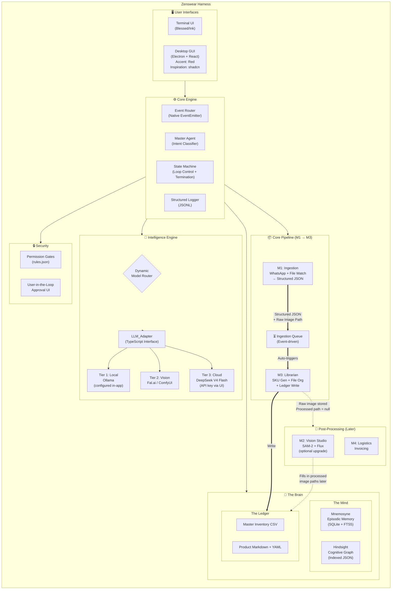

---

## 📋 Stage Index — Quick Reference

| Stage | Phase | What It Does | Status |
|:------|:------|:-------------|:-------|
| **S01** | Foundation | Create project folder + TypeScript setup | ✅ |
| **S02** | Foundation | Core types + contracts | ✅ |
| **S03** | Foundation | Event Router | ✅ |
| **S04** | Foundation | Structured JSONL Logger | ✅ |
| **S05** | Foundation | Agent State Machine (FSM) | ✅ |
| **S06** | Foundation | Basic Terminal UI | ✅ |
| **S07** | Intelligence | LLM_Adapter interface | ⬜ |
| **S08** | Intelligence | Ollama local adapter | ⬜ |
| **S09** | Intelligence | DeepSeek cloud adapter | ⬜ |
| **S10** | Intelligence | Cache telemetry parser | ⬜ |
| **S11** | Intelligence | Model Router + fallback chain | ⬜ |
| **S12** | Memory | Mnemosyne — SQLite + FTS5 | ⬜ |
| **S13** | Memory | Hindsight — Cognitive graph | ⬜ |
| **S14** | Memory | Ledger — CSV + Markdown | ⬜ |
| **S15** | Pipeline (M1→M3) | M1 — File watcher (Chokidar) | ⬜ |
| **S16** | Pipeline (M1→M3) | M1 — Hinglish text parser | ⬜ |
| **S17** | Pipeline (M1→M3) | Ingestion Queue (M1 → M3 bridge) | ⬜ |
| **S18** | Pipeline (M1→M3) | M3 — SKU generator | ⬜ |
| **S19** | Pipeline (M1→M3) | M3 — File organizer + Ledger writer | ⬜ |
| **S20** | Pipeline (M1→M3) | M1 — WhatsApp DOM scraper | ⬜ |
| **S21** | Post-Processing | M2 — SAM-2 segmentation | ⬜ |
| **S22** | Post-Processing | M2 — Flux generation tracks | ⬜ |
| **S23** | Post-Processing | M4 — Invoice generator | ⬜ |
| **S24** | Desktop | Electron shell + IPC bridge | ⬜ |
| **S25** | Desktop | React dashboard + settings UI | ⬜ |
| **S26** | Desktop | Memory inspector + pipeline view | ⬜ |

---

## Session Handoff Protocol

> [!IMPORTANT]
> **After every coding session**, the agent MUST create/update a handoff file. This ensures ANY agent (or you) can pick up exactly where we left off.

**Handoff file location:** `zenswear-harness/docs/handoffs/HANDOFF_SXXX_[date].md`

### Handoff Template

```markdown
# Session Handoff — Stage SXX

> **Date:** YYYY-MM-DD
> **Stage:** SXX — [Stage Name]
> **Status:** ✅ Complete / 🟡 In Progress / ❌ Blocked

## What Was Done
- [Bullet list of every file created/modified]
- [What was tested and result]

## What's Working
- [List of things you can test right now]
- [Commands to run to verify]

## What's NOT Working / Known Issues
- [Any bugs, incomplete features, or edge cases]

## Decisions Made (with rationale)
- [Decision]: [Why we chose this]

## What's Next
- [Exact next step for the next session]
- [Files to touch, functions to write]

## Context for Next Agent
- [Any important context a new agent would need]
- [Links to relevant files]
- [Gotchas to watch out for]

## PI AGENT LEARNING Updates
- [What was added to the learning modules]
- [Which module was enriched]
```

---

## PI AGENT LEARNING — Update Protocol

After each stage, the agent updates the corresponding learning module:

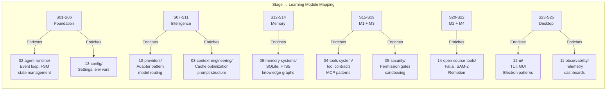

---

## Phase 1 — Foundation (Stages S01–S06)

### What This Phase Achieves
By the end of Phase 1, you will have:
- A running TypeScript project
- An event-driven core engine
- A state machine that controls agent loops
- A terminal UI showing real-time logs
- Structured JSONL logging

> **No AI models, no APIs, no memory yet.** This is pure infrastructure. If you can see events flowing through the terminal UI, Phase 1 is done.

---

### Stage S01 — Project Scaffold

**What:** Create the project folder, initialize Node.js + TypeScript, set up the directory tree.

**Files Created:**

```
e:\ZEN'S WEAR\Zenswear Harness\zenswear-harness\
├── package.json
├── tsconfig.json
├── .env.example           # Template for API keys (filled later via UI)
├── .gitignore
├── .pi/
│   └── SYSTEM.md          # Agent instruction file
├── src/
│   └── index.ts           # "Hello Zenswear" entry point
├── data/
│   ├── memory/            # Empty — for Mnemosyne + Hindsight later
│   └── ledger/            # Empty — for CSV + MD later
├── assets/
│   ├── 1_Raw_Assets/
│   ├── 2_Processed_Assets/
│   └── 3_Publishable_Generations/
└── docs/
    ├── ARCHITECTURE.md    # Living architecture doc
    ├── DECISIONS.md        # ADR log
    └── handoffs/           # Session handoff files
```

**Dependencies Installed:**
```json
{
  "devDependencies": {
    "typescript": "^5.x",
    "@types/node": "^22.x",
    "tsx": "^4.x"
  }
}
```

**Acceptance Criteria:**
- [ ] `npx tsx src/index.ts` prints "🔴 Zenswear Harness — Starting..."
- [ ] TypeScript compiles with zero errors
- [ ] All directories exist

**Learning Update:** Add entry to `notes/insights.md` about project structure decisions.

---

### Stage S02 — Core Types & Contracts

**What:** Define every TypeScript type and interface the system will use. This is the "contract layer" — every module talks through these types.

**Why this matters:** If the types are right, everything else snaps together. If the types are wrong, everything breaks silently.

**File:** `src/core/types.ts`

**Key Types Defined:**

```typescript
// Agent lifecycle states
type AgentState = 'IDLE' | 'ROUTING' | 'EXECUTING' | 'WAITING_APPROVAL' | 'ERROR';

// Every event in the system is one of these
type AgentEvent = {
  id: string;
  timestamp: string;
  type: 'agent:start' | 'agent:end' | 'tool:call' | 'tool:result' 
      | 'memory:write' | 'memory:read' | 'ui:update' | 'error'
      | 'fallback:triggered' | 'approval:requested' | 'approval:resolved';
  source: string;       // Which module emitted this
  payload: unknown;     // Event-specific data
};

// Standard tool I/O — every tool follows this contract
interface ToolPayload {
  toolName: string;
  parameters: Record<string, unknown>;
}

interface ToolResult {
  success: boolean;
  data?: unknown;
  error?: string;
  durationMs: number;
}

// LLM inference contract
interface InferencePayload {
  systemPrompt: string;
  userMessage: string;
  tools?: ToolDefinition[];
  outputSchema?: JSONSchema;
  maxTokens?: number;
  temperature?: number;
}

interface InferenceResult {
  content: string;
  toolCalls?: ToolCall[];
  usage: TokenUsage;
  model: string;
  wasFallback: boolean;
}

interface TokenUsage {
  promptTokens: number;
  completionTokens: number;
  cacheHitTokens?: number;    // DeepSeek specific
  cacheMissTokens?: number;   // DeepSeek specific
  estimatedCostUSD: number;
}
```

**Acceptance Criteria:**
- [ ] All types compile with `tsc --noEmit`
- [ ] Types are imported successfully by a test file

**Learning Update:** Add to `02-agent-runtime/` — "How we defined our event schema"

---

### Stage S03 — Event Router

**What:** The central nervous system. All modules communicate by emitting and listening to typed events.

**File:** `src/core/event-router.ts`

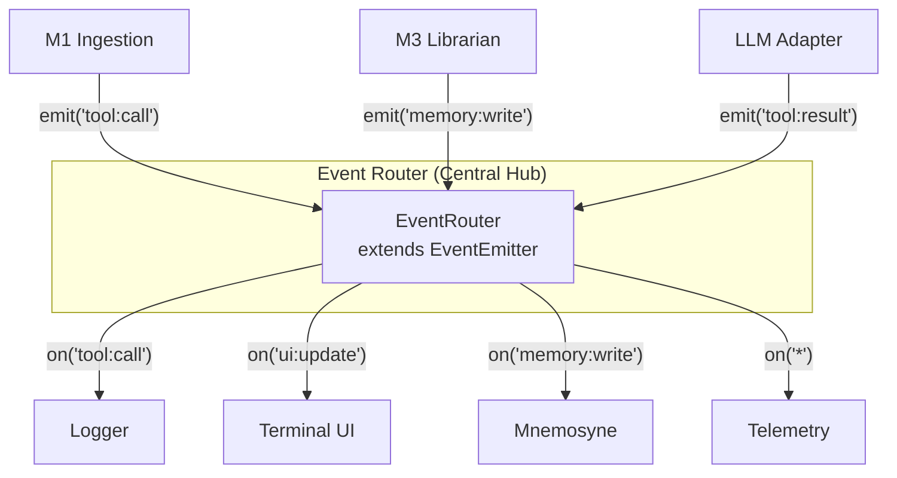

**What the Event Router does:**
1. Accepts typed `AgentEvent` objects
2. Broadcasts them to all registered listeners
3. Logs every event to the JSONL logger (Stage S04)
4. Provides `emit()`, `on()`, `once()`, `off()` with full TypeScript typing

**Acceptance Criteria:**
- [ ] Can emit an event and receive it in a listener
- [ ] Events are strongly typed — wrong event type = compile error
- [ ] Running `npx tsx src/index.ts` shows events being emitted and received in console

---

### Stage S04 — Structured JSONL Logger

**What:** Every event gets logged to a `.jsonl` file. This is the flight recorder — if anything goes wrong, you can replay what happened.

**File:** `src/core/logger.ts`

**What it does:**
1. Listens to ALL events from the Event Router
2. Appends each event as a single JSON line to `data/logs/session_YYYY-MM-DD_HH-mm.jsonl`
3. Rotates log files per session
4. Provides `readLastN(n)` to read recent events

**Output example (`session_2026-08-24_10-30.jsonl`):**
```json
{"id":"evt_001","timestamp":"2026-08-24T10:30:01Z","type":"agent:start","source":"core","payload":{}}
{"id":"evt_002","timestamp":"2026-08-24T10:30:02Z","type":"tool:call","source":"m1-ingestion","payload":{"toolName":"parse_text","parameters":{"text":"Red tshirt 550rs M L XL"}}}
```

**Acceptance Criteria:**
- [ ] Events from S03 automatically appear in the JSONL file
- [ ] File is valid JSONL (each line is valid JSON)
- [ ] `readLastN(5)` returns the last 5 events

---

### Stage S05 — Agent State Machine (FSM)

**What:** The brain's traffic controller. Prevents infinite loops, enforces execution limits, detects hallucination patterns.

**File:** `src/core/state-machine.ts`

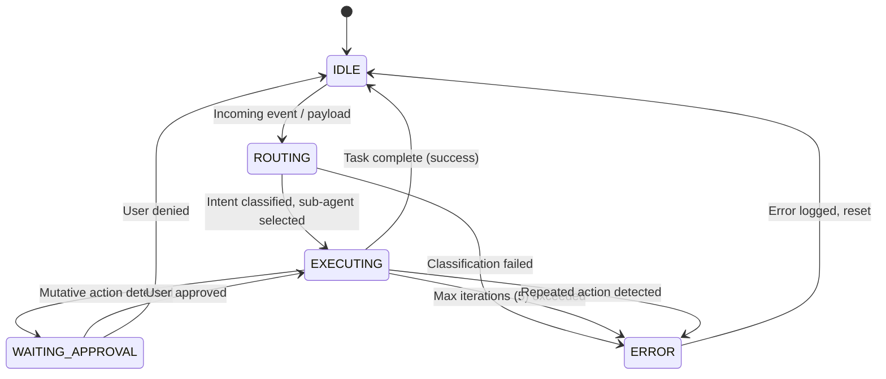

**Safety features built into the FSM:**
1. **Max 5 iterations** per sub-agent execution — hard stop
2. **Repeated action detection** — same tool + same params in consecutive turns = halt
3. **Token budget** — each execution has a max token spend before circuit breaker
4. **Mutative action gate** — writes/deletes trigger WAITING_APPROVAL state

**Acceptance Criteria:**
- [ ] FSM transitions correctly between all states
- [ ] Attempting a 6th iteration throws and returns to IDLE
- [ ] Duplicate action detection works
- [ ] State transitions emit events to Event Router

---

### Stage S06 — Basic Terminal UI

**What:** A simple but functional terminal interface that shows what's happening inside the engine.

**File:** `src/ui/terminal.ts`

**What it shows:**
```
┌─────────────────────────────────────────────────┐
│  🔴 ZENSWEAR HARNESS                           │
│  State: IDLE  │  Model: —  │  Events: 12       │
├─────────────────────────────────────────────────┤
│                                                 │
│  [10:30:01] agent:start — Core initialized      │
│  [10:30:02] tool:call — parse_text invoked      │
│  [10:30:03] tool:result — JSON parsed (1.2s)    │
│  [10:30:04] memory:write — Episode logged       │
│                                                 │
├─────────────────────────────────────────────────┤
│  > Ready for input...                           │
└─────────────────────────────────────────────────┘
```

**Acceptance Criteria:**
- [ ] TUI launches with `npx tsx src/index.ts`
- [ ] Shows real-time event stream from Event Router
- [ ] Shows current FSM state
- [ ] Can type commands and see responses

**🎉 Phase 1 Complete Checkpoint:** Run `npx tsx src/index.ts` → see the TUI → type a test command → see events flow through → check the JSONL log file. If all that works, Phase 1 is done.

---

## Phase 2 — Intelligence Engine (Stages S07–S11)

### What This Phase Achieves
By the end of Phase 2, you will have:
- A model-agnostic LLM interface
- Working Ollama local inference (configured via UI later)
- Working DeepSeek cloud inference with cache telemetry
- Automatic fallback: cloud fails → local takes over
- Cost tracking per inference call

---

### Stage S07 — LLM_Adapter Interface

**What:** The abstract contract that ALL model providers must implement. This is why the system is model-agnostic — swap models without touching any business logic.

**File:** `src/adapters/llm-adapter.ts`

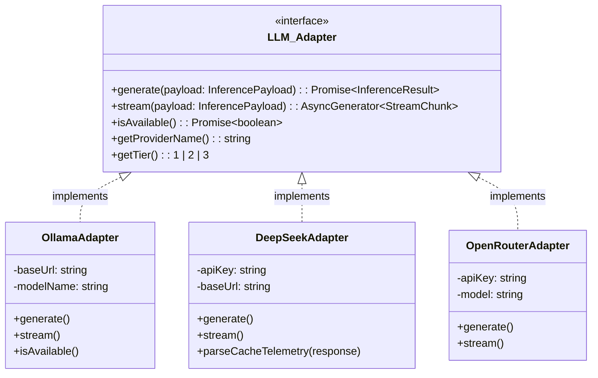

**Acceptance Criteria:**
- [ ] Interface compiles
- [ ] A mock adapter implementing the interface compiles and passes a basic test

---

### Stage S08 — Ollama Local Adapter

**What:** Connect to locally running Ollama. No model is pulled yet — we just verify the connection works and the adapter returns properly shaped data.

**File:** `src/adapters/ollama.ts`

**What it does:**
1. Connects to `http://localhost:11434` (Ollama default)
2. Checks if Ollama is running (`isAvailable()`)
3. Lists available models
4. Sends inference requests via Ollama's API
5. Returns results shaped as `InferenceResult`

**Acceptance Criteria:**
- [ ] `isAvailable()` returns `true` when Ollama is running, `false` when not
- [ ] Can list models via the adapter
- [ ] If a model is pulled later, `generate()` returns valid `InferenceResult`

---

### Stage S09 — DeepSeek Cloud Adapter

**What:** Connect to DeepSeek V4 Flash via the OpenAI-compatible SDK. API key will be configured later via the web UI — for now we use `.env`.

**File:** `src/adapters/deepseek.ts`

**Prompt structure enforced (for cache optimization):**

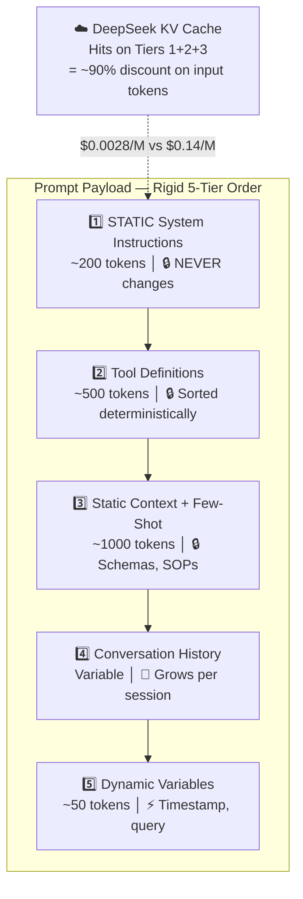

**Acceptance Criteria:**
- [ ] Can send a test prompt to DeepSeek (if API key available)
- [ ] Response includes `prompt_cache_hit_tokens` and `prompt_cache_miss_tokens`
- [ ] Returns valid `InferenceResult` with `TokenUsage`

---

### Stage S10 — Cache Telemetry Parser

**What:** Extract and display DeepSeek cache metrics so you can SEE how much money you're saving.

**File:** `src/adapters/telemetry.ts`

**Metrics calculated:**

| Metric | Formula | What It Tells You |
|:---|:---|:---|
| Cache Hit Rate | `(hit_tokens / total_prompt_tokens) × 100` | How well is the prompt structured? |
| Query Cost | `(hits × $0.0028/M) + (misses × $0.14/M) + (output × $0.28/M)` | Exact cost of this call |
| Session Cost | Sum of all query costs | Running total for this session |

**Acceptance Criteria:**
- [ ] Telemetry parser extracts hit/miss/completion tokens
- [ ] Cost calculation matches manual calculation
- [ ] Metrics are emitted as events to the Event Router

---

### Stage S11 — Model Router + Fallback Chain

**What:** The decision engine that picks which model to use and handles failures gracefully.

**File:** `src/adapters/model-router.ts`

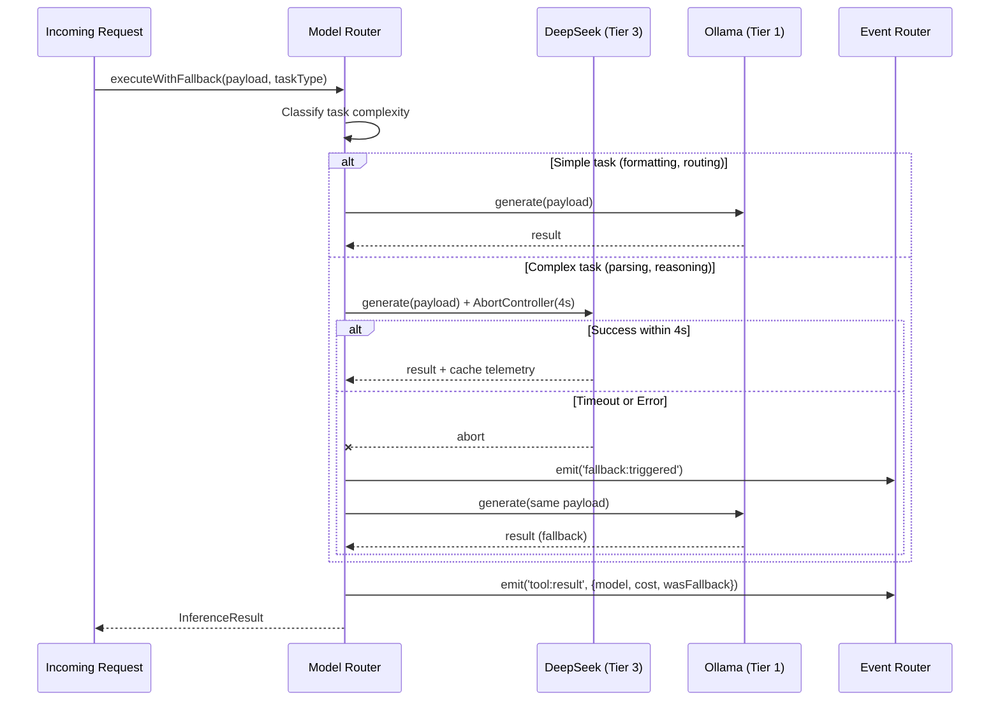

**Acceptance Criteria:**
- [ ] Router selects Tier 1 for simple tasks, Tier 3 for complex
- [ ] Fallback triggers within 4 seconds on timeout
- [ ] Fallback event is logged
- [ ] Same payload goes to fallback — no data loss

**🎉 Phase 2 Complete Checkpoint:** Send a test prompt → see it routed to the right model → see cache telemetry in the TUI → disconnect internet → see fallback to Ollama.

---

## Phase 3 — Memory: The Brain (Stages S12–S14)

### What This Phase Achieves
By the end of Phase 3, you will have:
- A persistent SQLite database for episodic memory (survives restarts)
- A cognitive knowledge graph that the agent can "learn" into
- A deterministic CSV/Markdown inventory system that NO LLM can hallucinate

---

### Stage S12 — Mnemosyne: Episodic Memory (SQLite + FTS5)

**What:** The agent's diary. Every action, thought, tool call, and fallback gets recorded here and is instantly searchable.

**File:** `src/memory/mnemosyne.ts`

**Database:** `data/memory/mnemosyne.db` (SQLite with WAL mode)

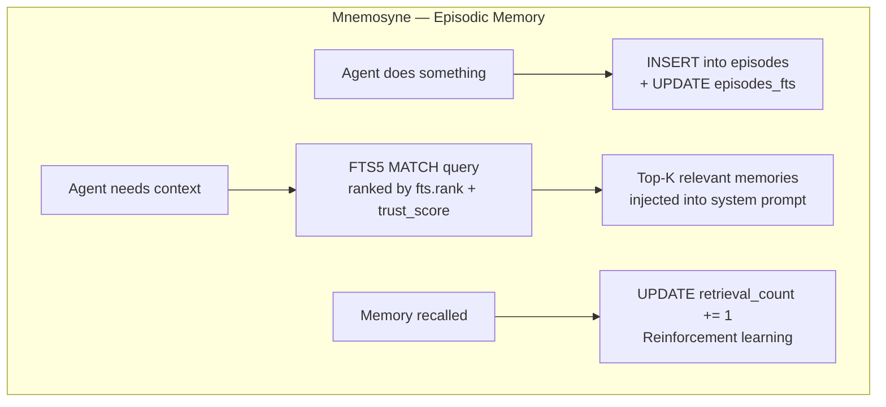

**Schema:**
```sql
CREATE TABLE episodes (
    id INTEGER PRIMARY KEY,
    timestamp TEXT NOT NULL,
    session_id TEXT NOT NULL,
    agent TEXT NOT NULL,
    action TEXT NOT NULL,
    tool_name TEXT,
    tool_input TEXT,
    tool_output TEXT,
    status TEXT NOT NULL,
    thought TEXT,
    trust_score REAL DEFAULT 1.0,
    retrieval_count INTEGER DEFAULT 0
);

CREATE VIRTUAL TABLE episodes_fts USING fts5(
    action, thought, tool_name, tool_input,
    content='episodes', content_rowid='id'
);
```

**Acceptance Criteria:**
- [ ] Insert an episode → search for it via FTS5 → get it back in <1ms
- [ ] Data persists across process restarts
- [ ] WAL mode enabled (concurrent read/write without locks)

---

### Stage S13 — Hindsight: Cognitive Knowledge Graph

**What:** What the agent has LEARNED. Unlike Mnemosyne (which logs what happened), Hindsight stores reusable rules and patterns.

**File:** `src/memory/hindsight.ts`

**Storage:** `data/memory/hindsight/` — indexed JSON files

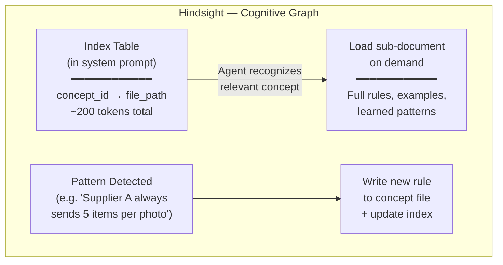

**Example concept file (`data/memory/hindsight/supplier-patterns.json`):**
```json
{
  "conceptId": "supplier-patterns",
  "title": "Supplier Behavior Patterns",
  "rules": [
    {
      "id": "sp-001",
      "rule": "Supplier A sends exactly 5 items per photo, always with Hinglish descriptions",
      "confidence": 0.9,
      "learnedAt": "2026-08-24T10:30:00Z",
      "evidence": ["session_001", "session_003"]
    }
  ]
}
```

**Acceptance Criteria:**
- [ ] Can add a new concept with rules
- [ ] Index table stays under 200 tokens
- [ ] On-demand loading works (only loads what's relevant)

---

### Stage S14 — Ledger: Transactional Data (CSV + Markdown)

**What:** Hard business data. SKUs, prices, stock counts. NO LLM touches this — it's pure programmatic read/write.

**File:** `src/memory/ledger.ts`

**Files managed:**
- `data/ledger/master_inventory.csv` — The source of truth for all inventory
- `data/ledger/products/*.md` — Individual product files with YAML frontmatter

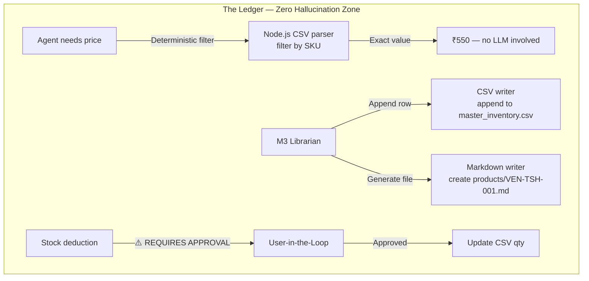

**Acceptance Criteria:**
- [ ] Read a price from CSV by SKU — returns exact value
- [ ] Append a new row — CSV remains valid
- [ ] Generate a Markdown product file with YAML frontmatter
- [ ] Stock deduction requires explicit approval (ties into FSM WAITING_APPROVAL)

**🎉 Phase 3 Complete Checkpoint:** Insert a memory → search for it → see it in the TUI. Add a product to CSV → read it back. Add a learned rule → verify it loads on demand.

---

## Phase 4A — Core Pipeline: M1 Ingestion → M3 Librarian (Stages S15–S20)

> [!IMPORTANT]
> **M1 and M3 are ONE connected pipeline.** Data flows directly from ingestion into the Librarian without any manual step. Raw images are stored as-is — no vision processing yet. M2 Vision slots in later as a post-processing upgrade.

### The Connected Pipeline

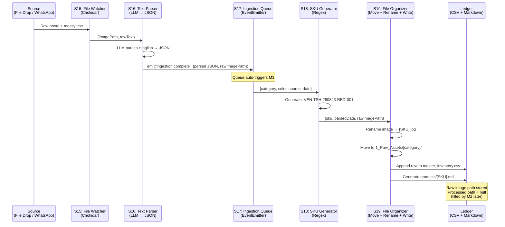

### How Raw Images Work (Before M2 Vision)

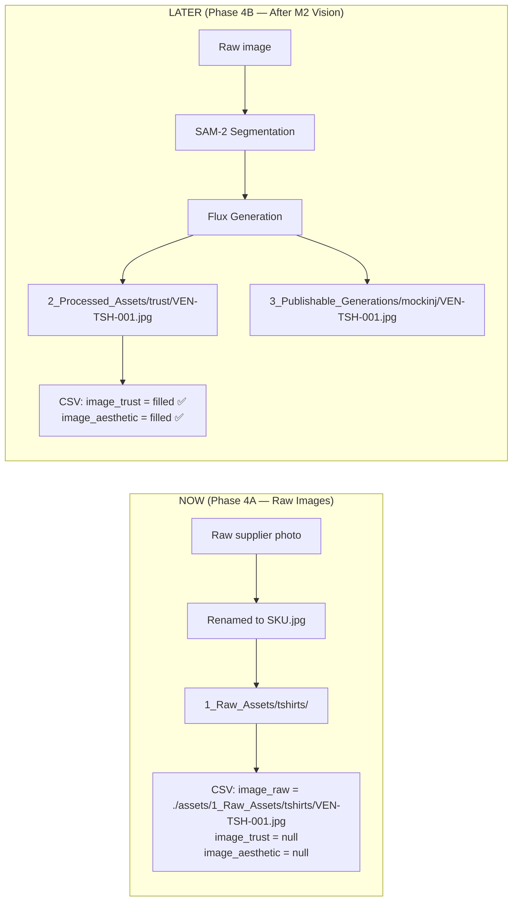

---

### Stage S15 — M1: File Watcher (Chokidar)

**What:** Monitor a local folder for new supplier photos. When a photo drops, trigger the ingestion pipeline.

**File:** `src/modules/m1-ingestion/file-watcher.ts`

**What it does:**
1. Watches `assets/1_Raw_Assets/_inbox/` for new files
2. On new file → emits `ingestion:file-detected` event
3. Debounced (waits 500ms after last file in a batch)
4. Passes `{imagePath, timestamp}` to the text parser

**Acceptance Criteria:**
- [ ] Drop a test image in `assets/1_Raw_Assets/_inbox/` → event emitted in TUI
- [ ] Supports `.jpg`, `.png`, `.webp`
- [ ] Debounced (doesn't fire 50 events for one drag-and-drop)
- [ ] Event contains correct file path and timestamp

---

### Stage S16 — M1: Hinglish Text Parser

**What:** Take messy supplier text ("Red tshirt 550rs M L XL bhai") and extract structured JSON.

**File:** `src/modules/m1-ingestion/text-parser.ts`

**Input:** `"Red tshirt 550rs M L XL bulk available"`
**Output:**
```json
{
  "category": "t-shirt",
  "color": "red",
  "price": 550,
  "currency": "INR",
  "sizes": ["M", "L", "XL"],
  "source": "vendor",
  "notes": "bulk available",
  "rawImagePath": "assets/1_Raw_Assets/_inbox/photo_001.jpg"
}
```

**Uses:** Model Router → Tier 3 (DeepSeek/Cloud) for parsing, Tier 1 (Ollama) as fallback.

**Acceptance Criteria:**
- [ ] Parses 5 different sample Hinglish inputs correctly
- [ ] Returns valid JSON matching the output schema
- [ ] Falls back to local model if cloud is down
- [ ] Attaches the raw image path to the output

---

### Stage S17 — Ingestion Queue (M1 → M3 Bridge)

**What:** The glue between M1 and M3. When ingestion produces parsed data, it goes into a queue that automatically triggers M3 processing.

**File:** `src/modules/pipeline/ingestion-queue.ts`

**Why a queue?**
- Multiple photos can arrive at once (batch drops from supplier)
- Each item must be processed sequentially to avoid SKU collisions
- If M3 fails on one item, the rest stay in the queue
- Queue state persists — if the app crashes, unprocessed items aren't lost

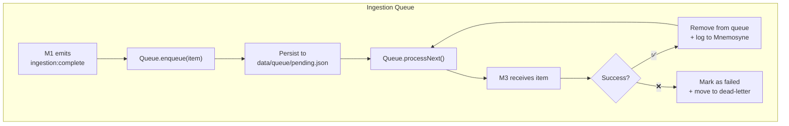

**Acceptance Criteria:**
- [ ] Enqueue 3 items → they process sequentially
- [ ] Kill the process mid-queue → restart → remaining items still pending
- [ ] Failed items don't block the queue
- [ ] Queue status visible in TUI

---

### Stage S18 — M3: SKU Generator

**What:** Generate deterministic, unique SKU codes from parsed ingestion data.

**File:** `src/modules/m3-librarian/sku-generator.ts`

**SKU Format:** `[SOURCE]-[CATEGORY]-[YYMMDD]-[COLOR]-[SEQUENCE]`

**Examples:**
- `VEN-TSH-260823-RED-001` → Vendor T-Shirt, Red, first item on Aug 23
- `LOC-JNS-260823-BLU-002` → Local Jeans, Blue, second item on Aug 23

**Rules:**
1. Source: `VEN` (vendor/wholesale) or `LOC` (local shop)
2. Category: `TSH` (t-shirt), `JNS` (jeans), `SHT` (shirt), etc. — configurable map
3. Date: `YYMMDD` from ingestion timestamp
4. Color: first 3 chars, uppercase
5. Sequence: auto-incrementing per day, read from CSV to avoid duplicates

**Acceptance Criteria:**
- [ ] Generates correct SKU from parsed JSON
- [ ] No duplicate SKUs (checks existing CSV)
- [ ] Handles unknown categories gracefully (defaults to `GEN`)

---

### Stage S19 — M3: File Organizer + Ledger Writer

**What:** The final step — rename the raw image, move it to the right folder, and write to both CSV and Markdown.

**File:** `src/modules/m3-librarian/file-organizer.ts`

**What it does (in order):**
1. **Rename** raw image → `[SKU].jpg`
2. **Move** to `assets/1_Raw_Assets/[category]/[SKU].jpg`
3. **Append** row to `data/ledger/master_inventory.csv`
4. **Generate** `data/ledger/products/[SKU].md` with YAML frontmatter

**CSV row written:**
```csv
SKU,Source,Brand,Category,Color,Price_INR,Stock_Qty,Image_Raw,Image_Trust,Image_Aesthetic,Status,Created_At
VEN-TSH-260823-RED-001,VendorA,Zenswear,T-Shirt,Red,550,0,./assets/1_Raw_Assets/tshirts/VEN-TSH-260823-RED-001.jpg,null,null,pending_vision,2026-08-23T10:30:00Z
```

> Note: `Image_Trust` and `Image_Aesthetic` are `null` — they get filled when M2 Vision processes this item later.

**Markdown file generated (`data/ledger/products/VEN-TSH-260823-RED-001.md`):**
```markdown
---
sku: VEN-TSH-260823-RED-001
source: VendorA
brand: Zenswear
category: T-Shirt
color: Red
price_inr: 550
stock_qty: 0
sizes: [M, L, XL]
image_raw: ./assets/1_Raw_Assets/tshirts/VEN-TSH-260823-RED-001.jpg
image_trust: null
image_aesthetic: null
status: pending_vision
created_at: 2026-08-23T10:30:00Z
---

# VEN-TSH-260823-RED-001

Red T-Shirt from VendorA. Awaiting vision processing.
```

**Acceptance Criteria:**
- [ ] Raw image renamed and moved to correct folder
- [ ] CSV row appended with all fields (Image_Trust/Aesthetic = null)
- [ ] Markdown file generated with valid YAML frontmatter
- [ ] Status = `pending_vision` (ready for M2 later)
- [ ] Whole pipeline works end-to-end: drop image → parsed → SKU → CSV + MD

---

### Stage S20 — M1: WhatsApp DOM Scraper

**What:** Puppeteer script that extracts images and text from WhatsApp Web. Manually triggered. Feeds into the same pipeline as file drops.

**File:** `src/modules/m1-ingestion/whatsapp-scraper.ts`

> [!WARNING]
> This is the most complex module. It requires user-supervised QR login and handles blob URLs by injecting base64 conversion scripts into the DOM. **We build this AFTER the file-drop pipeline is proven stable.**

**Acceptance Criteria:**
- [ ] Opens WhatsApp Web in Chromium
- [ ] Waits for QR scan (manual, user-supervised)
- [ ] Extracts images (bypassing blob URLs via base64 injection)
- [ ] Extracts associated text messages
- [ ] Outputs to the same Ingestion Queue (S17) — reuses entire M3 pipeline

**🎉 Phase 4A Complete Checkpoint:** Drop an image + paste some Hinglish text → see it parsed → SKU generated → CSV row written → Markdown file created → raw image organized. The full ingestion pipeline works end-to-end with raw images.

---

## Phase 4B — Post-Processing: Vision + Logistics (Stages S21–S23)

> [!NOTE]
> **Phase 4B is OPTIONAL for now.** The core pipeline (4A) works perfectly with raw images. Phase 4B upgrades those raw images with AI-generated visuals and adds invoicing. Build this when you're ready and have API keys for Fal.ai.

### Stage S21 — M2: SAM-2 Segmentation

**What:** Take raw product images and isolate the garment using Segment Anything (SAM-2) via Fal.ai API.

**File:** `src/modules/m2-vision/segmentation.ts`

**Accepts:** Items with `status: pending_vision` from the Ledger
**Outputs:** Transparent PNG to `assets/2_Processed_Assets/`
**Updates:** CSV `Image_Trust` field, status → `pending_generation`

**Acceptance Criteria:**
- [ ] Reads items with `pending_vision` status from CSV
- [ ] Sends raw image to SAM-2 via Fal.ai
- [ ] Saves transparent PNG
- [ ] Updates CSV row

### Stage S22 — M2: Flux Generation Tracks

**What:** Generate two image variants from the segmented garment:
1. **Zenswear Trust Track** — realistic wholesale shop counter background
2. **Mockinj Aesthetic Track** — high-end streetwear studio aesthetics

**File:** `src/modules/m2-vision/generation.ts`

**Updates:** CSV `Image_Trust` and `Image_Aesthetic` fields, status → `complete`

### Stage S23 — M4: Invoice Generator

**What:** Brand-aware PDF invoicing using pdfkit. Generates styled invoices based on SKU brand (Zenswear vs Mockinj).

**File:** `src/modules/m4-logistics/invoice.ts`

---

## Phase 5 — Desktop GUI (Stages S24–S26)

### Stage S24 — Electron Shell

**What:** Wrap the entire CLI application into an Electron desktop app with IPC bridge to the Node.js backend.

### Stage S25 — React Dashboard + Settings UI

**What:** The main interface. Includes:
- **Dashboard** — pipeline status, cost gauge, active model, cache hit rate
- **Settings** — API key input fields (DeepSeek, OpenRouter, Fal.ai), Ollama URL configuration, model selection, folder paths
- **Styling** — Red accent, shadcn-inspired components, GSAP micro-animations

### Stage S26 — Memory Inspector + Pipeline View

**What:** Visual tools for examining the brain:
- **Memory Inspector** — search Mnemosyne, browse Hindsight graph
- **Pipeline View** — M1→M3 pipeline status, M2 post-processing status, manual triggers

---

## 🔒 Security Architecture

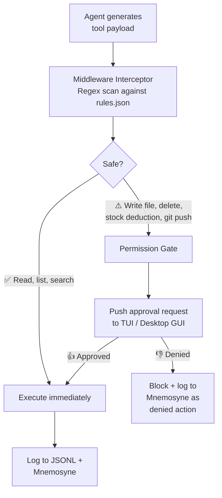

---

## Verification Strategy

### Per-Stage Verification
Every stage includes its own acceptance criteria (see above). The coding agent MUST verify all criteria pass before marking a stage complete.

### End-of-Phase Integration Tests

| Phase | Integration Test |
|:------|:-----------------|
| Phase 1 | TUI launches → events flow → JSONL file created |
| Phase 2 | Send prompt → routed correctly → fallback works → cost tracked |
| Phase 3 | Write memory → search it → write to CSV → read it back |
| Phase 4A | Drop image → parsed → queued → SKU → CSV + MD → raw image organized |
| Phase 4B | Raw image → SAM-2 segment → Flux generate → CSV updated with processed paths |
| Phase 5 | Desktop app launches → all features accessible via GUI |

### Manual Verification (by you)
- Run the app and see it working
- Check JSONL logs to understand what happened
- Review handoff documents
- Browse PI AGENT LEARNING for updated knowledge

---

## 📱 Local-to-Phone Access

The harness runs on your laptop locally. To access the dashboard from your phone (same network or remote):

| Method | How It Works | When to Use |
|:---|:---|:---|
| **LAN IP** | Expose Electron/web UI on `0.0.0.0:PORT`, access via `192.168.x.x:PORT` on phone | Same WiFi network |
| **Tailscale** | Free, encrypted mesh VPN — your phone and laptop see each other anywhere | Remote access, secure, recommended |
| **ngrok / localtunnel** | Temporary public URL tunnel | Quick demos, testing from anywhere |

We'll wire this into Stage S24 (Electron shell) — the web UI serves on a local port that's accessible from any device on the network. A simple toggle in settings to enable/disable remote access.

---

## What's Paused (Future Scope)

| Feature | Why It's Paused | When It Activates |
|:---|:---|:---|
| OpenWA CRM | High complexity, third-party deps | After M1-M3 stable |
| Bulk WhatsApp Messaging | Meta charges per message | When marketing budget allocated |
| AI Video (Kling/Veo) | Expensive, non-deterministic | When local video models improve |
| Shiprocket API | Requires live API keys, address parsing | Phase 2 MVP rollout |
| Remotion Video Generation | Needs Mockinj aesthetic templates | After M2 Vision stable |

---

## Ready to Start?

> [!IMPORTANT]
> **Approve this plan to begin Stage S01 — Project Scaffold.** I'll create the project folder, set up TypeScript, and get the "Hello Zenswear" entry point running. Then I'll write the first handoff document.
